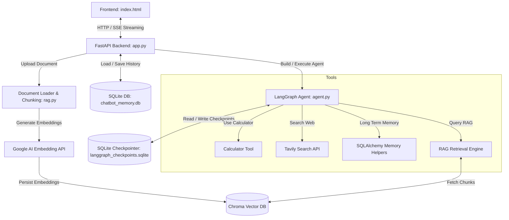

# NipunGPT

NipunGPT is a premium, feature-rich agentic chatbot built on top of **FastAPI**, **LangGraph**, and the **Gemini 2.5** suite of models. It is designed to act as an advanced AI assistant similar to ChatGPT, capable of executing complex workflows, accessing long-term memory, performing math calculations, conducting web searches, and running RAG (Retrieval-Augmented Generation) on uploaded documents.

---

## 🌟 Key Features

- **Agentic Workflow**: Managed by LangGraph state machines, coordinating chat, memory recall, tool calling, and RAG search.
- **Dynamic Tool Calling**:
  - **Tavily Web Search**: Accesses real-time online information for queries about current events.
  - **Local Memory**: Saves user preferences or facts (`remember_this`) and recalls them in future interactions (`recall_memory`) using SQLAlchemy and SQLite.
  - **Calculator**: Evaluates math expressions securely.
  - **Document RAG**: Query uploaded documents (`search_uploaded_documents`).
- **Comprehensive Document Ingestion**: Supports `.pdf`, `.docx`, `.txt`, `.md`, `.py`, and `.csv` files. Extracted text is split into overlapping chunks, vectorized via `GoogleGenerativeAIEmbeddings` (`gemini-embedding-001`), and stored locally in a Chroma vector database.
- **Premium Frontend Interface**: Responsive dark-themed UI built with HTML/CSS, offering smooth CSS animations, recent chat lists, persistent thread IDs, speech-to-text dictation, and real-time Server-Sent Events (SSE) streaming.
- **Enterprise-ready CI/CD & Containerization**: Fully dockerized with a GitHub Actions workflow targeting AWS EC2 deployment via Amazon ECR.

---

## 🛠️ Project Architecture



---

## 🚀 Getting Started

### 📋 Prerequisites

Ensure you have Python 3.11+ installed.

### 🔧 Installation

1. **Clone the repository:**
   ```bash
   git clone <repository-url>
   cd Nipungpt
   ```

2. **Create and activate a virtual environment:**
   * **Windows (PowerShell):**
     ```powershell
     python -m venv .venv
     Set-ExecutionPolicy -ExecutionPolicy RemoteSigned -Scope Process
     .venv\Scripts\Activate.ps1
     ```
   * **macOS/Linux:**
     ```bash
     python -m venv .venv
     source .venv/bin/activate
     ```

3. **Install the dependencies:**
   ```bash
   pip install -r requirements.txt
   ```

4. **Set up Environment Variables:**
   Create a `.env` file in the root directory (or update the existing one):
   ```env
   GOOGLE_API_KEY="your-gemini-api-key"
   TAVILY_API_KEY="your-tavily-api-key"
   GOOGLE_MODEL="gemini-2.5-flash"
   ```

---

## 💻 Running the Application

### Locally
Start the FastAPI server using the virtual environment's Python interpreter:
```bash
python app.py
```
Or directly via Uvicorn:
```bash
uvicorn app:app --host 127.0.0.1 --port 8080 --reload
```
Open your browser and navigate to `http://127.0.0.1:8080`.

### Running with Docker
1. **Build the Docker Image:**
   ```bash
   docker build -t nipungpt-app .
   ```
2. **Run the Container:**
   ```bash
   docker run -d -p 8080:8080 --env-file .env nipungpt-app
   ```

---

## 🛸 CI/CD & Cloud Deployment

This repository includes a GitHub Actions pipeline [`.github/workflows/cicd.yaml`](.github/workflows/cicd.yaml) to continuously deploy updates to an AWS EC2 instance:
1. Pushes build to **Amazon ECR**.
2. Deploys to EC2 via a **GitHub Self-Hosted Runner**.
3. Re-runs the Docker container on port `8080` with the corresponding secrets injected.

Make sure to populate your GitHub repository secrets:
* `AWS_ACCESS_KEY_ID`
* `AWS_SECRET_ACCESS_KEY`
* `AWS_DEFAULT_REGION`
* `ECR_REPO`
* `GOOGLE_API_KEY`
* `TAVILY_API_KEY`
